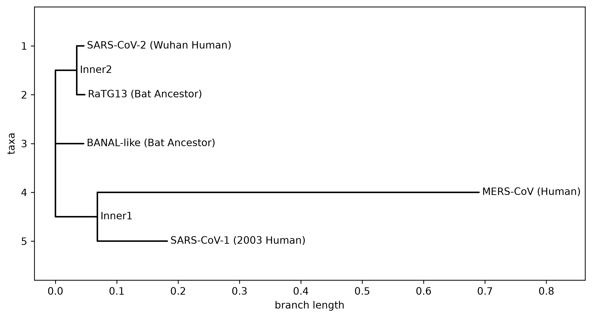

# Evolutionary Divergence of Coronavirus Spike Proteins
## Project Overview
### Aim  
To computationally analyse and visualise the evolutionary divergence of coronavirus spike proteins, utilising bioinformatics pipelines (Biopython, Clustal Omega) to pinpoint the specific genetic mutations responsible for the unique transmissibility of SARS-CoV-2.

### Data Source  
Raw amino acid sequences were retrieved directly from the NCBI Database in FASTA format. The dataset consists of the spike glycoproteins from five distinct viral strains:  
* SARS-CoV-2 (Wuhan Human)
* SARS-CoV-1 (2003 Human) 
* MERS-CoV (Human)
* RaTG13 (Bat Ancestor)
* BANAL-like (Bat Ancestor) 

To view the sequences - see the [raw_data](raw_data) folder for the .fasta files

### Biological Question  
How does the evolutionary history of the spike protein, specifically the *microscopic acquisition of the PRRA furin cleavage site*, explain why SARS-CoV-2 triggered a highly contagious global pandemic, while its closest wild bat ancestors and previous human coronavirus strains did not?

## Installation & Dependencies  
To replicate this project and run the computational pipelines locally, ensure you have Python 3.x installed.  
1. Clone this repository to your local machine
>```
>https://github.com/sivani-hash/SARS-CoV-2-Phylogeny.git
>```

2. Open your terminal or command prompt and navigate to the project folder

   
3. Install the required dependencies using the provided [requirements.txt](requirements.txt) file:

>```
>pip install -r requirements.txt
>```

### Core Libraries Used:  
* ```biopython```: Used for parsing FASTA files, reading Clustal alignments, calculating genetic distance matrices, and building phylogenetic trees.
* ```matplotlib```: Used for the high-resolution, publication-ready rendering of the phylogenetic trees.
* ```jupyter```: Used as the interactive coding environment to execute the bioinformatics pipelines.


## Results Overview  
### Phylogenetic Analysis


<br>

<table>

  
  <tr>
    <!-- Left Column: Image and Caption -->
    <td width="50%" valign="top">
      
      <p align="center"><i>Fig 1: Phylogenetic relationship among five distinct coronavirus strains for spike proteins.</i></p>
    </td>  
    <td width="50%" valign="top">
      <p> The generated phylogenetic tree visually maps the evolutionary relationships and genetic distances between the five distinct coronavirus spike proteins.</p>
      <ul>
        <li><b>The Bat Origins of SARS-CoV-2:</b> In this tree we observe the tight clustering of SARS-CoV-2 with the two bat coronavirus isolates: <b>RaTG13</b> and the <b>BANAL-like strain</b>. The incredibly short horizontal branch lengths connecting these three viruses indicate a very high percentage of amino acid identity, providing computational evidence that SARS-CoV-2 shares a very recent common ancestor with wild horseshoe bat coronaviruses.</li> 
      </ul>
    </td>
  </tr> 
</table>

<ul>
  <li><b>SARS-CoV-1 vs. SARS-CoV-2:</b> While SARS-CoV-1 (the cause of the 2003 outbreak) and SARS-CoV-2 both infect human ACE2 receptors, the tree shows they are genetically distinct. SARS-CoV-1 branches off much earlier in the evolutionary timeline, visualizing that SARS-CoV-2 did not simply mutate directly from the 2003 virus.</li>
  <br>
  <li><b>MERS-CoV as the Outgroup:</b> MERS-CoV sits at the bottom of the tree on an exceptionally long horizontal branch. This massive distance aligns perfectly with viral taxonomy, as MERS belongs to a completely different viral subgenus (Merbecovirus) compared to the other four viruses (Sarbecovirus).</li>
</ul>

Example in a juypter notebook - see [codes](codes) folder for [tree_building.ipynb](tree_building.ipynb) and [MSA_combining.ipynb](MSA_combining.ipynb). These codes were used to combine the induvidual FASTA files of the 5 strains and build the tree. 


For Multiple Sequence Alignment (MSA), Clustal Omega software was used. View [clustalw.aln](clustalw.aln) file to see the alignment.
<br>

### Structural Analysis: The Furin Cleavage Site  
While the phylogenetic tree shows the overall macroscopic similarity of the spike proteins, the true key to SARS-CoV-2's unique pandemic potential lies at the microscopic level; specifically, a tiny 4-amino-acid insertion (PRRA) that allows the spike to be primed by human furin enzymes. To investigate this, a Python script was developed to programmatically index the multiple sequence alignment (MSA) and extract the precise locus of this mutation across all five viral genomes.

Sequence Alignment Output:
>```
>--- Furin Cleavage Site Alignment ---
>YP_009724390.1  | TQTNSPRRARSVASQ  <-- SARS-CoV-2 (Wuhan Human)
>QHR63300.2      | TQTNS----RSVASQ  <-- RaTG13 (Bat Ancestor)
>XBU76397.1      | TQTNS----RSVASQ  <-- BANAL-like (Bat Ancestor)
>AAP13441.1      | TVSLLR----STSQK  <-- SARS-CoV-1 (2003 Human)
>YP_009047204.1  | TPSTLTPRSVRSVPG  <-- MERS-CoV (Human)
>```
Example in a juypter notebook - see [codes](codes) folder for [PRRA.ipynb](PRRA.ipynb) file.

The above alignment allows visualization of the precise evolutionary insertion. Both bat ancestors (RaTG13, BANAL-like) and the 2003 SARS-CoV-1 virus contain a stark deletion (`----`) at this coordinate. Only SARS-CoV-2 possesses the `PRRA` insertion, which allows host enzymes to cleave and prime the viral proteins during assembly,drastically increasing transmissibility.


## Future Directions & Limitations

While this computational pipeline successfully highlights the macroscopic evolutionary divergence and microscopic insertion events of the SARS-CoV-2 spike protein, future expansions to this research could include:

* **Scaling the Genomic Dataset:** Expanding the multiple sequence alignment from five representative strains to a large-scale dataset (e.g., utilizing GISAID or NCBI Virus) to construct a more highly resolved and comprehensive phylogenetic network.
* **Advanced Tree Algorithms:** Transitioning from the current Neighbor-Joining (NJ) distance method to Maximum Likelihood (ML) or Bayesian inference models to improve the statistical robustness of the evolutionary topology.
* **3D Structural Visualization:** Integrating structural bioinformatics tools (such as PyMOL or ChimeraX) to map the PRRA furin cleavage site directly onto the 3D crystal structure of the spike protein trimer, visualizing its physical accessibility to human enzymes.
* **Wet-Lab Correlation:** Connecting these *in-silico* sequence alignment findings with *in-vitro* pseudovirus entry assays to physically quantify the impact of the PRRA cleavage site on cellular infectivity.
  


   

