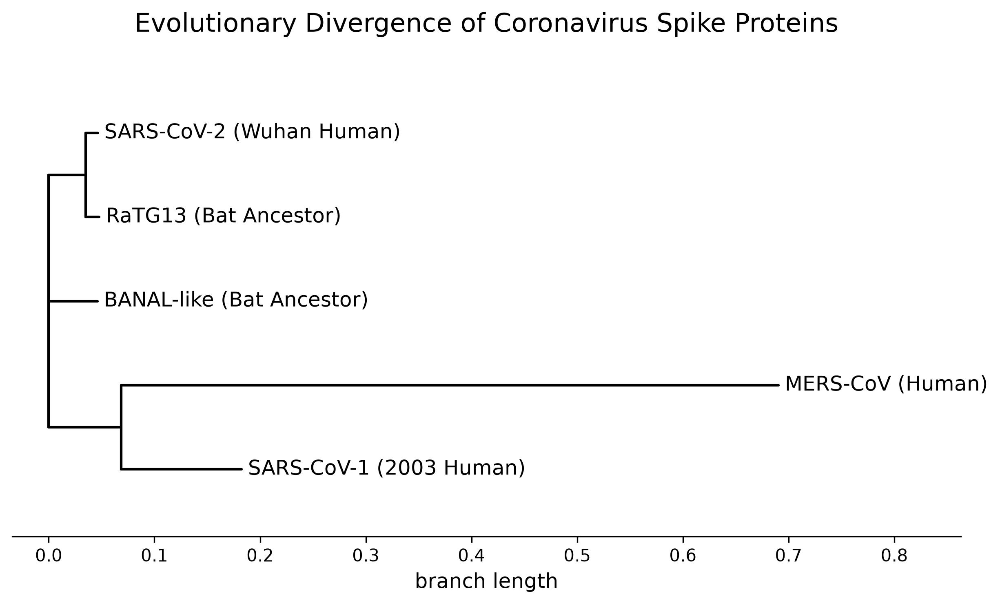

# Evolutionary Divergence of Coronavirus Spike Proteins
## Project Overview
### Aim  
To computationally analyse and visualise the evolutionary divergence of coronavirus spike proteins, utilising bioinformatics pipelines (Biopython, Clustal Omega) to pinpoint the specific genetic mutations responsible for the unique transmissibility of SARS-CoV-2.

### Data Source  
Raw amino acid sequences were retrieved directly from the NCBI Database in FASTA format. The dataset consists of the spike glycoproteins from five distinct viral strains:  
* SARS-CoV-2 (Wuhan Human)
* SARS-CoV-1 (2003 Human) 
* MERS-CoV (Human)
* RaTG13 (Bat Ancestor)
* BANAL-like (Bat Ancestor)

To view the sequences - see the [raw_data](raw_data) folder for the .fasta files

### Biological Question  
How does the evolutionary history of the spike protein, specifically the *microscopic acquisition of the PRRA furin cleavage site*, explain why SARS-CoV-2 triggered a highly contagious global pandemic, while its closest wild bat ancestors and previous human coronavirus strains did not?

## Installation & Dependencies  
To replicate this project and run the computational pipelines locally, ensure you have Python 3.x installed.  
1. Clone this repository to your local machine
2. Open your terminal or command prompt and navigate to the project folder
3. Install the required dependencies using the provided [requirements.txt](requirements.txt) file:

>```
>pip install -r requirements.txt
>```

### Core Libraries Used:  
* ```biopython```: Used for parsing FASTA files, reading Clustal alignments, calculating genetic distance matrices, and building phylogenetic trees.
* ```matplotlib```: Used for the high-resolution, publication-ready rendering of the phylogenetic trees.
* ```jupyter```: Used as the interactive coding environment to execute the bioinformatics pipelines.

## Results Overview  
### Phylogenetic Analysis  


The generated phylogenetic tree visually maps the evolutionary relationships and genetic distances between the five distinct coronavirus spike proteins.  
* **The Bat Origins of SARS-CoV-2:** In this tree we observe the tight clustering of **SARS-CoV-2** with the two bat coronavirus isolates: **RaTG13** and the **BANAL-like strain**. The incredibly short horizontal branch lengths connecting these three viruses indicate a very high percentage of amino acid identity, providing computational evidence that SARS-CoV-2 shares a very recent common ancestor with wild horseshoe bat coronaviruses.
* **SARS-CoV-1 vs. SARS-CoV-2:** While SARS-CoV-1 (the cause of the 2003 outbreak) and SARS-CoV-2 both infect human ACE2 receptors, the tree shows they are genetically distinct. SARS-CoV-1 branches off much earlier in the evolutionary timeline, visualizing that SARS-CoV-2 did not simply mutate directly from the 2003 virus.
* **MERS-CoV as the Outgroup: MERS-CoV** sits at the bottom of the tree on an exceptionally long horizontal branch. This massive distance aligns perfectly with viral taxonomy, as MERS belongs to a completely different viral subgenus (Merbecovirus) compared to the other four viruses (Sarbecovirus).
<br clear="left"/>


   

